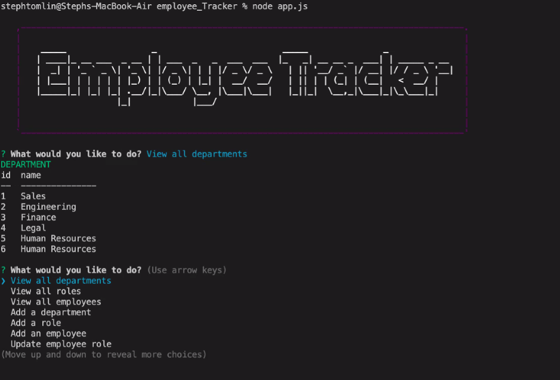

# employeeTracker

Employee Tracker is a node.js application that utilizes MySQL workbench. This application manages all employees within a company by organizing various departments and the roles within them. This app adds, views, and updates information and was developed using Node, Inquirer and MySQL.

